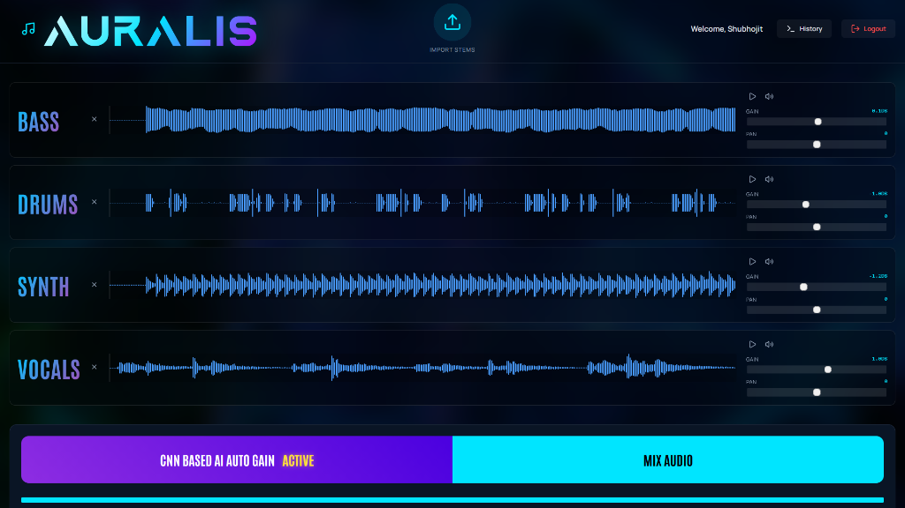
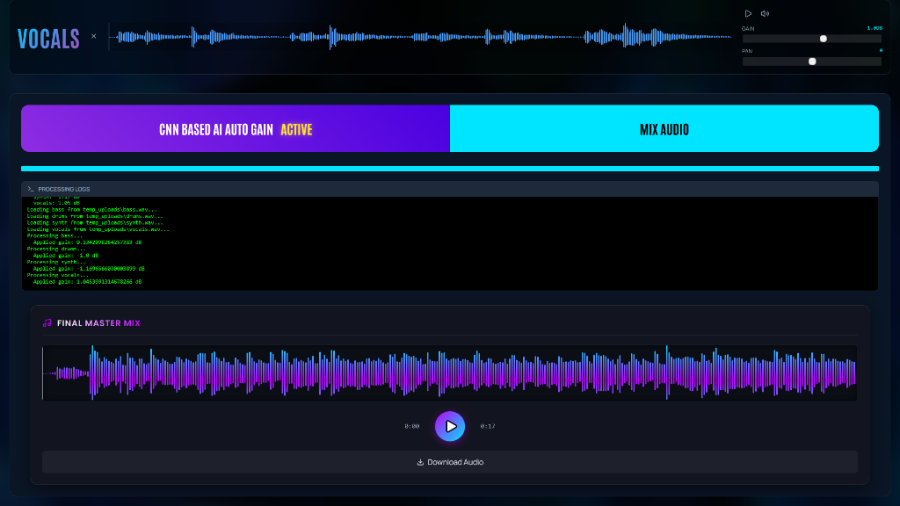
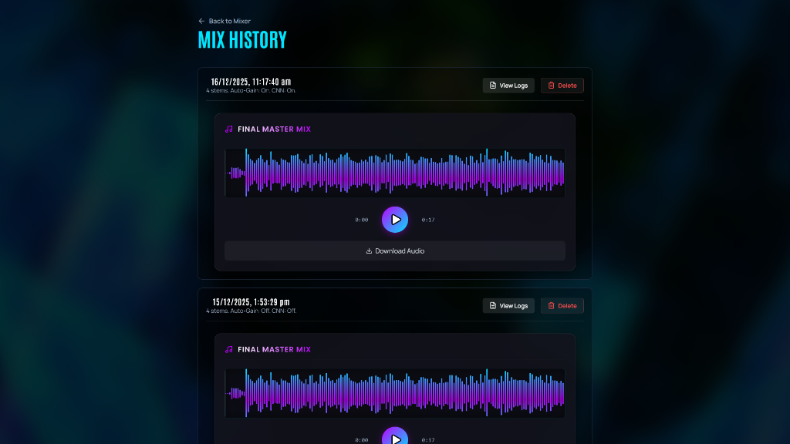

# Auralis - Intelligent Audio Stem Mixer

Auralis is a professional-grade web-based audio stem mixer that leverages AI to automatically balance and process your multi-track audio projects. Built with a modern React frontend and a powerful Python FastAPI backend.

## Features

- **Smart Mixing Engine**: Automated gain balancing using rule-based algorithms (with CNN capabilities).
- **Interactive Dashboard**: Real-time waveform visualization, volume faders, and panning controls.
- **Mix History**: Automatically saves your mix sessions. View logs, replay past mixes, and download results.
- **User Authentication**: Secure login and registration system with JWT authentication.
- **Modern UI**: sleek, dark-themed interface with smooth animations and responsive design.

## Showcase






## Architecture

### Backend (`web_server/` & `audio_engine/`)
- **Framework**: FastAPI
- **Audio Processing**: Custom `audio_engine` using `numpy`, `librosa`, and `soundfile`.
- **Database**: SQLAlchemy with SQLite (default).
- **Authentication**: OAuth2 with Password hashing.

### Frontend (`web_client/`)
- **Framework**: React (Vite)
- **Styling**: Pure CSS with advanced animations and glassmorphism effects.
- **Visualization**: WaveSurfer.js for audio waveforms.
- **Icons**: Lucide React.

## Installation & Setup

### Prerequisites
- Python 3.8+
- Node.js 16+

### 1. Backend Setup

```bash
# Install dependencies
pip install -r requirements.txt

# Run the server
uvicorn web_server.main:app --reload
```
The API will be available at `http://localhost:8000`.

### 2. Frontend Setup

```bash
cd web_client

# Install dependencies
npm install

# Run the development server
npm run dev
```
The application will be accessible at `http://localhost:5173`.

## Usage

1. **Register/Login**: Create an account to access the mixer.
2. **Import Stems**: Click the central "Import Stems" button to upload your audio tracks (drums, bass, vocals, etc.).
3. **Adjust Controls**: Use the sliders to adjust gain (dB) and pan (L/R) for each stem.
4. **AI Auto-Gain**: Toggle "CNN Based AI Auto Gain" to let the engine predict optimal levels.
5. **Mix**: Click "Mix Audio" to process the final output.
6. **History**: Access the history page to view previous mixes, logs, and download past creations.

## Project Structure

- `audio_engine/`: Core Python modules for audio processing and gain prediction.
- `web_server/`: FastAPI application, database models, and API endpoints.
- `web_client/`: React source code, components, and pages.
- `output/`: Generated mix files (git-ignored).
- `temp_uploads/`: Temporary storage for uploaded stems (git-ignored).
